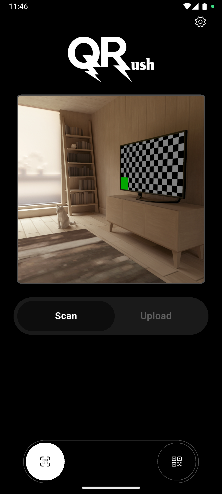
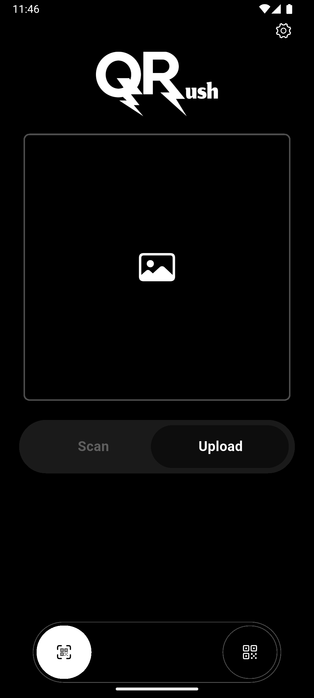
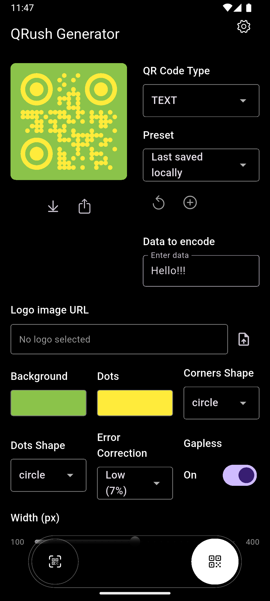

<div align="center">
  
  
  ### ⚡ *Lightning-fast QR scanning at your fingertips* ⚡
  
  [](https://flutter.dev)
  [](https://dart.dev)
  [](LICENSE)
  [](https://github.com/yourusername/qrush/stargazers)
  [](https://github.com/yourusername/qrush/network/members)
  [](https://github.com/yourusername/qrush/issues)
  [](https://github.com/yourusername/qrush/releases)
</div>

---


## 📊 Project Stats

<div align="center">
  
| 📱 **Platforms** | 📏 **Code Quality** | 🔒 **Security** | 
|:---:|:---:|:---:
| iOS • Android • Windows • macOS • Linux | [](https://www.codefactor.io/repository/github/realbazer/qrush) | [](https://github.com/realbazer/qrush/security) |

</div>

---

## 📸 Screenshots

<!-- Screenshots placeholder - Add your app screenshots here -->
<div align="center">
  
  
  
</div>

---

## ✨ Features

<!-- Features section - Fill this with your app's features -->
- 🚀 **Feature 1** - Scan barcodes & share/open links
- 📱 **Feature 2** - Upload barcodes from gallery
- 🔒 **Feature 3** - Create & share barcodes
- 🎨 **Feature 4** - Customize your own barcodes
- ⚡ **Feature 5** - Create barcodes with emails,phones,sms and etc.
- ⭐ **Feature 4** - You can add your own presets
- 👾 **Feature 5** - Adding a logo to a barcode

---

## 🚀 Getting Started

### Prerequisites

Before you begin, ensure you have the following installed:
- [Flutter](https://flutter.dev/docs/get-started/install) (3.0.0 or higher)
- [Dart](https://dart.dev/get-dart) (3.0.0 or higher)
- [Git](https://git-scm.com/)

### Installation

1. **Clone the repository**
   ```bash
   git clone https://github.com/yourusername/qrush.git
   cd qrush
   ```

2. **Install dependencies**
   ```bash
   flutter pub get
   ```

3. **Run the app**
   ```bash
   flutter run
   ```

### Building for Production

#### Android
```bash
flutter build apk --release
# Or for app bundle
flutter build appbundle --release
```

#### iOS
```bash
flutter build ios --release
```

#### Desktop
```bash
# Windows
flutter build windows --release

# macOS
flutter build macos --release

# Linux
flutter build linux --release
```

---

## 🛠️ Tech Stack

<div align="center">

| Category | Technology |
|:---:|:---:|
| **Framework** |  |
| **Language** |  |
| **State Management** | ❌ |

</div>

---

## 📱 Supported Platforms

<div align="center">

| Platform | Status | Version |
|:---:|:---:|:---:|
| 🤖 **Android** | ✅ Supported | API 21+ |
| 🍎 **iOS** | ✅ Supported | iOS 12+ |
| 🖥️ **Windows** | ✅ Supported | Windows 10+ |
| 🍎 **macOS** | ✅ Supported | macOS 10.14+ |
| 🐧 **Linux** | ✅ Supported | Ubuntu 18.04+ |

</div>

---

## 🎯 Roadmap & To-Do

<!-- To-Do section - Fill this with your future plans -->
### 🔮 Upcoming Features
- [ ] **Feature A** - Adding more barcode customization
- [ ] **Feature B** - History of created barcodes
- [ ] **Feature C** - Add support for adding GIFs and photos to background

### 🐛 Known Issues
- [ ] **Issue 1** - Smoke and light theme don't work together
- [ ] **Issue 2** - Some errors on windows and mac

### 💡 Future Enhancements
- [ ] **Enhancement 1** - Improve code quality and add state managment
- [ ] **Enhancement 2** - Improve the function of adding a logo

---

## 🤝 Contributing

We love contributions! Please see our [Contributing Guidelines](CONTRIBUTING.md) for details.

### Quick Start for Contributors

1. Fork the repository
2. Create your feature branch (`git checkout -b feature/AmazingFeature`)
3. Commit your changes (`git commit -m 'Add some AmazingFeature'`)
4. Push to the branch (`git push origin feature/AmazingFeature`)
5. Open a Pull Request

---

## 📄 License

This project is licensed under the MIT License - see the [LICENSE](LICENSE) file for details.

---

## 🙏 Acknowledgments

- Thanks to the Flutter team for the amazing framework
- Thank you for the [library](https://pub.dev/packages/mobile_scanner))
- Special thanks to all contributors

---

## 📞 Support & Contact

<div align="center">

[](https://github.com/realbazer/qrush/discussions)
[](https://x.com/realbazer)

**Found a bug?** [Report it here](https://github.com/realbazer/qrush/issues/new?assignees=&labels=bug&template=bug_report.md)

**Have a feature request?** [Suggest it here](https://github.com/realbazer/qrush/issues/new?assignees=&labels=enhancement&template=feature_request.md)

</div>

---

<div align="center">
  
  **⭐ Star this repo if you found it helpful! ⭐**
  
  Made with ❤️ by [Emin](https://github.com/realbazer)
  
</div>
